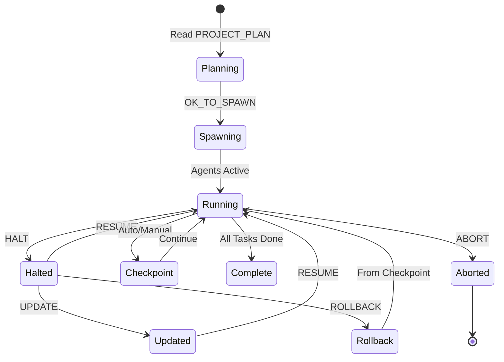

# Token Control Guide - Master Your Multi-Agent Workflow

## 🎮 Control Tokens Overview

Control tokens are special commands that manage the multi-agent orchestration. Type them directly in your Claude Code prompt to control execution flow.

## 🚦 Primary Control Tokens

### `OK_TO_SPAWN` 
**Purpose**: Approve the implementation plan and begin parallel agent spawning
**Automatic Action**: Updates PROJECT_PLAN.md from `MODE=PLAN_ONLY` to `MODE=PLAN_AND_EXECUTE`
**When to use**: After reviewing Agent-01's plan
**Example**:
```
> Read PROJECT_PLAN.md and act as Agent-01
[Agent-01 presents plan with MODE=PLAN_ONLY]
> OK_TO_SPAWN
[Agent-01 automatically updates to MODE=PLAN_AND_EXECUTE]
[Parallel spawning begins immediately]
```

### `HALT`
**Purpose**: Immediately stop all agents and save state
**When to use**: Need to pause work, change direction, or handle issues
**Example**:
```
> HALT
[All agents stop, state saved to .claude/state/]
```

### `RESUME`
**Purpose**: Continue from last checkpoint
**When to use**: After HALT, to continue where you left off
**Example**:
```
> RESUME
[Agents reload state and continue]
```

### `UPDATE` (Two Modes)

#### Mode 1: Versioned Update (Recommended for Major Changes)
**Purpose**: Systematic update with full spec revision
**When to use**: Adding major features, changing architecture
**Process**:
```bash
# 1. Create update file
vim .claude/spec/00-v1-update.md
# (Next time: 00-v2-update.md, then v3, etc.)

# 2. In Claude:
> UPDATE

# Agent-01 automatically:
# - Reads your update file
# - Updates all spec files
# - Updates ENGINEERING_LOG.md
# - Updates outstanding tasks
# - Spawns agents for new work
```

#### Mode 2: Inline Update (Quick Changes)
**Purpose**: Fast updates without creating files
**When to use**: Small tweaks, quick additions
**Process**:
```
> HALT
> Add dark mode to the UI
> UPDATE AND RESUME
```

### `RESET`
**Purpose**: Clear all states and start fresh
**When to use**: Need complete restart
**Example**:
```
> RESET
[All states cleared, ready for fresh start]
> Read PROJECT_PLAN.md and act as Agent-01
```

### `ABORT`
**Purpose**: Emergency stop without saving
**When to use**: Something went wrong
**Example**:
```
> ABORT
[All agents terminated, no state saved]
```

### `MERGE_TO_MAIN`
**Purpose**: Deploy to production branch
**When to use**: After gates pass, ready for production
**Example**:
```
> MERGE_TO_MAIN
[Merges development → main branch]
```

## 🔄 Advanced Workflow Patterns

### Pattern 1: Inline Update (Your Requested Workflow)
**Stop, update requirements inline, and continue:**

```bash
# Working on project...
> HALT

# Type your updates directly (no separate brief needed!)
> I need to add real-time notifications using WebSockets to the chat feature.
Also implement user presence indicators. Make the UI more modern with 
glassmorphism effects. UPDATE AND RESUME

# Agents process the inline update and continue
[Agent-01 processes changes]
[Agents adapt and continue with new requirements]
```

### Pattern 2: Mid-Flight Pivot
**Change direction while preserving completed work:**

```bash
# Original plan running...
> HALT

> REPLAN: Pivot from REST to GraphQL for all APIs. Keep existing models.
> OK_TO_SPAWN

[Agent-01 creates new plan preserving completed work]
[New parallel spawn begins]
```

### Pattern 3: Incremental Development
**Build in stages with review points:**

```bash
# Stage 1: Core features
> Read PROJECT_PLAN.md with MODE=PLAN_ONLY
> OK_TO_SPAWN

# After core is done
> HALT
> UPDATE: Now add premium features from section 2 of the brief
> RESUME

# After premium features
> HALT  
> UPDATE: Add admin dashboard
> RESUME
```

### Pattern 4: Emergency Recovery
**When things go wrong:**

```bash
# If agents get stuck or confused
> HALT
> RESET  # Clear all agent states

# Review what was completed
> cat ENGINEERING_LOG.md

# Continue with fresh state
> RESUME FROM CHECKPOINT-3  # Resume from specific checkpoint
```

### Pattern 5: Parallel Debugging
**Fix issues without stopping everything:**

```bash
# Some agents working, one has issues
> HALT AGENT-04  # Stop only the problematic agent

> UPDATE AGENT-04: Fix the database connection issue, use connection pooling
> RESUME AGENT-04

# Other agents continue working throughout
```

## 📝 Inline Update Syntax Guide

### Simple Inline Update
```
> HALT
> Add dark mode to the UI. UPDATE AND RESUME
```

### Multi-Line Inline Update
```
> HALT
> Need the following changes:
- Add OAuth2 with Google and GitHub
- Implement rate limiting on all endpoints  
- Add Redis caching layer
- Create admin analytics dashboard
UPDATE AND RESUME
```

### Targeted Update
```
> HALT
> UPDATE FRONTEND: Switch from Tailwind to Material-UI
> UPDATE BACKEND: Add GraphQL subscriptions
> RESUME ALL
```

### Priority Update
```
> HALT
> URGENT: Fix the security vulnerability in user authentication first.
Then continue with the rest. UPDATE AND RESUME
```

## 🎯 Token Combinations

### `UPDATE AND RESUME`
Your requested pattern - update inline and continue
```
> HALT
> [Your changes here]
> UPDATE AND RESUME
```

### `REPLAN AND SPAWN`
Complete replanning with new spawn
```
> HALT
> REPLAN: [New requirements]
> OK_TO_SPAWN
```

### `CHECKPOINT AND CONTINUE`
Save state but keep running
```
> CHECKPOINT
[State saved but agents continue]
```

### `REVIEW AND GATE`
Trigger gate reviews
```
> REVIEW: Security
[Agent-03 performs security review]
> REVIEW: Testing  
[Agent-12 runs all tests]
```

## 🛡️ Safety Controls

### `ABORT`
**Emergency stop - discards current work**
```
> ABORT
[All agents stop, no state saved]
```

### `ROLLBACK`
**Revert to previous checkpoint**
```
> ROLLBACK TO CHECKPOINT-5
[Reverts all changes since checkpoint 5]
```

### `VALIDATE`
**Check system state**
```
> VALIDATE
[Shows agent status, conflicts, and issues]
```

## 💡 Pro Tips

### 1. Parallel Monitoring
Always run the dashboard in another terminal:
```bash
# Monitor logs
tail -f logs/agents.jsonl
```

### 2. State Management
Check saved states:
```bash
ls -la .claude/state/
cat .claude/state/checkpoint-latest.json
```

### 3. Quick Status
```
> STATUS
[Shows all agent states and progress]
```

### 4. Targeted Control
Control specific agents:
```
> HALT AGENT-04,AGENT-07
> UPDATE AGENT-04: [changes]
> RESUME AGENT-04
```

### 5. Batch Updates
Update multiple aspects at once:
```
> HALT
> BATCH UPDATE:
  - Frontend: Add PWA support
  - Backend: Implement caching
  - Database: Add indexes
  - DevOps: Setup CI/CD
> RESUME ALL
```

## 📊 Token State Flow



## 🔥 Quick Reference Card

| Token | Action | State Saved | Agents Stop |
|-------|--------|-------------|-------------|
| `OK_TO_SPAWN` | Start parallel execution | No | N/A |
| `HALT` | Stop all agents | Yes | All |
| `RESUME` | Continue from state | N/A | N/A |
| `UPDATE` | Modify plan | Yes | No |
| `UPDATE AND RESUME` | Inline update & continue | Yes | Temporary |
| `REPLAN` | New plan | Yes | All |
| `RESET` | Clear states | No | All |
| `ABORT` | Emergency stop | No | All |
| `ROLLBACK` | Revert to checkpoint | Yes | All |
| `CHECKPOINT` | Save state | Yes | No |
| `STATUS` | Show progress | No | No |
| `VALIDATE` | Check health | No | No |
| `/compact` | Compress context window | No | No |
| `/mcp list` | Show registered MCP tools | No | No |

## 🚀 Your Optimal Workflow

Based on your request, here's the recommended workflow:

```bash
# 1. Start project
claude .
> Read PROJECT_PLAN.md and act as Agent-01

# 2. Review and spawn
> OK_TO_SPAWN

# 3. Monitor in another terminal
# Monitor logs
tail -f logs/agents.jsonl

# 4. Make inline updates as needed
> HALT
> Add these features: [list your features]
> Also change the database to PostgreSQL
> And make the UI more modern
> UPDATE AND RESUME

# 5. Continue until complete
[Agents work in parallel]

# 6. Final review
> REVIEW: ALL GATES
> MERGE_TO_MAIN
```

## 📌 Important Notes

1. **Inline updates work best with HALT first** - This ensures clean state
2. **UPDATE AND RESUME is atomic** - Both happen or neither
3. **Parallel execution continues** after resume - Agents maintain parallelism
4. **State is always preserved** with HALT - Never lose work
5. **Multiple updates can be chained** - HALT once, update many times

---

**Remember**: The power of this system is in parallel execution. When you `OK_TO_SPAWN`, you're launching 10+ agents working simultaneously. Use `HALT` and `UPDATE AND RESUME` to steer this parallel workforce efficiently!